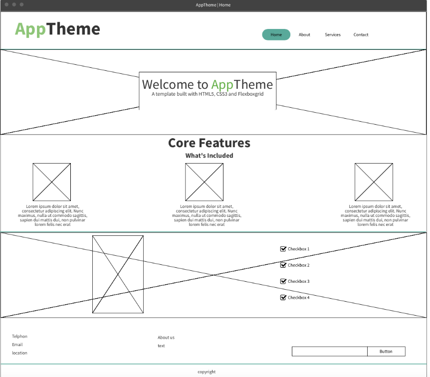
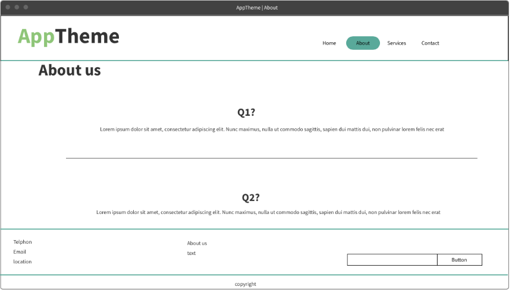
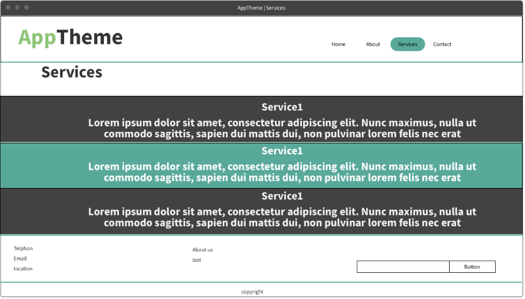
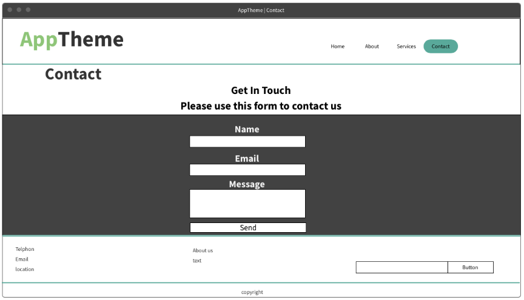

# Development Strategy
### Incremental-development-Week 2
> _`AppTheme` `Flexboxgrid` `individual project`_

## Project description
* About what this project?
>It's about web design.

* Which languages were used in this project?
>  

* Why Should we use it?
>It's a good tutorial to design a professional website.

## Wireframe

## 0. Set-Up
- As a fellow developer, I can see the prepared repository.
- As a site visitor, I can see an empty site at the correct URL.

#### Branch
1. Created a new repository generated from this template.
2. Clone the repository.
3. Push the markdown file `development-strategy.md` into the repo.
4. Start `README` file.
5. Push the changes.
6. Turn on GitHub Pages.

## 1. AppThem

#### Branches
- This user story was developed on a brach called `App-Theme`
- It was merged to `master` when the feature was finished.

###### `index.html`
* A header elements with a title describing the web page.
* Section elements.
* Boxes + images.
* Footer.

###### `style.css`
* Layout styling for the header & footer.
* Text styling for the main title.

## 2. About

#### Branches
- This user story was developed on a brach called `About`
- It was merged to `master` when the feature was finished.

###### `about.html`
* Showcase part

###### `style.css`
* Styling for the new element

## 3. Services

#### Branches
- This user story was developed on a brach called `Services`
- It was merged to `master` when the feature was finished.

###### `services.html`
* Services column + plans.

###### `style.css`
* Styling for the new element

## 4. Contact

#### Branches
- This user story was developed on a brach called `contact`
- It was merged to `master` when the feature was finished.

###### `cntact.html`
* Contact form

###### `style.css`
* Styling for the new element

## 4. Finishing Touches
- Complete `README` file with all details. 